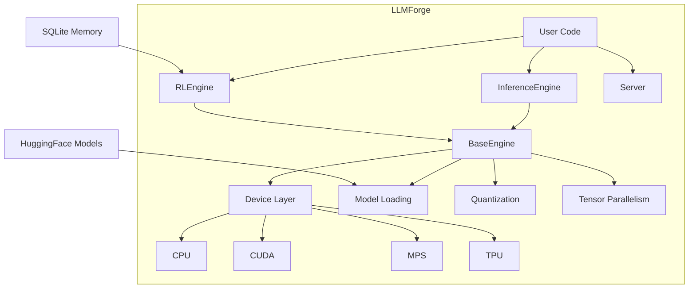

# LLMForge

*Powerful LLM Inference with RL Self-Improvement - Built on PyTorch*

---

## Why LLMForge?

LLMForge is a comprehensive framework for large language model inference and reinforcement learning self-improvement. It provides seamless multi-device support, intelligent model quantization, and unique self-improvement capabilities.


-   **Multi-Device Support**
    Run models on CPU, NVIDIA CUDA GPUs, Apple MPS, or Google TPU with automatic device detection and optimization.

-   **Massive Model Support**  
    Handle 400B+ parameter models with 4-bit quantization, intelligent offloading, and tensor parallelism.

-   **RL Self-Improvement**
    Improve outputs without fine-tuning using self-critique, best-of-N sampling, and iterative refinement strategies.

-   **Persistent Memory**
    SQLite-based memory stores high-quality responses and recalls them for similar prompts, improving over time.

-   **Hugging Face Integration**
    Use thousands of LLMs from Hugging Face Hub with built-in chat templates and tokenizer support.

-   **Streaming Generation**
    Real-time token-by-token streaming for interactive applications and responsive user experiences.


---

## Quick Install

```bash
pip install llmforge
```

Or install from source:

```bash
git clone https://github.com/ZandrixAI/llmforge.git
cd llmforge
pip install -e .
```

---

## Quick Start

### Basic Inference

```python
from llmforge import InferenceEngine

# Create inference engine - auto-detects best device
engine = InferenceEngine("Qwen/Qwen3-0.6B")

# Generate text
response = engine.generate("Explain quantum computing in simple terms.")
print(response)
```

### Chat Mode

```python
from llmforge import InferenceEngine

engine = InferenceEngine("Qwen/Qwen3-0.6B")

messages = [
    {"role": "system", "content": "You are a helpful coding assistant."},
    {"role": "user", "content": "How do I read a file in Python?"},
]

response = engine.chat(messages, max_tokens=256)
print(response)
```

### RL Engine with Self-Improvement

```python
from llmforge import RLEngine

# Create RL engine with memory
rl = RLEngine("Qwen/Qwen3-0.6B")

# Generate with auto-improvement
response = rl.generate("Explain gravity", strategy="auto")
print(response)

# Memory improves over time!
stats = rl.get_stats()
print(f"Generations: {stats['generations']}, Memory hits: {stats['memory_hits']}")
```

---

## Key Features Comparison

| Feature | LLMForge | vLLM | TGI |
|---------|----------|------|-----|
| Multi-device (CPU/GPU/MPS/TPU) | Yes | Limited | Limited |
| RL Self-Improvement | Yes | No | No |
| SQLite Memory | Yes | No | No |
| 400B+ Model Support | Yes | Yes | Yes |
| Hugging Face Models | Yes | Yes | Yes |
| PyTorch Native | Yes | No | No |

---

## Architecture

LLMForge uses a layered architecture:



### Component Overview

| Component | Description |
|-----------|-------------|
| **InferenceEngine** | Text generation and chat interface |
| **RLEngine** | Self-improvement with memory strategies |
| **Server** | OpenAI-compatible API server |
| **BaseEngine** | Core: device detection, model loading, quantization, tensor parallelism |

---

## Community

- **GitHub**: [Star us on GitHub](https://github.com/ZandrixAI/llmforge)
- **PyPI**: [Install from PyPI](https://pypi.org/project/llmforge/)
- **Issues**: [Report bugs](https://github.com/ZandrixAI/llmforge/issues)

---

## License

LLMForge is MIT licensed.